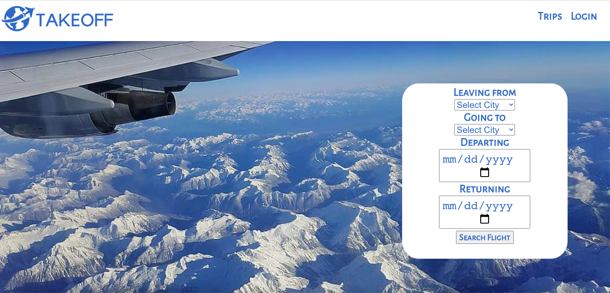
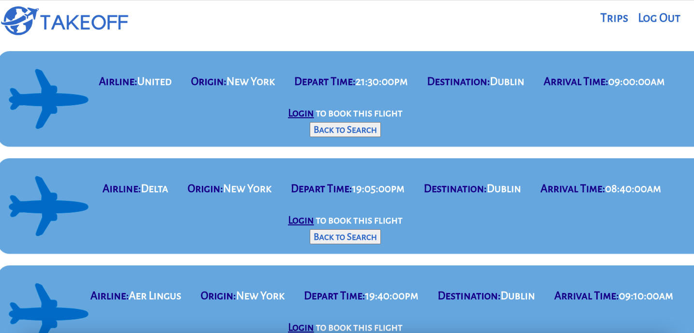

# Takeoff

## Date: 9/1/2022

### By: Emily Byrne

#### [LinkedIn](https://www.linkedin.com/in/emilybyrne3/) | [GitHub](https://github.com/embyrne13) | [Website](https://takeoffflight.herokuapp.com/)

---

### **_Description_**

#### This is the final project I made for General Assembly. Takeoff is a flight website where users can search cities and dates and be able to find the available flights.

---

### **_Technologies_**

- CSS
- Javascript
- GitHub
- VSCode
- [Trello](https://trello.com/b/NGLWc9dL/takeoff)

##### **_Overview_**

Welcome to Takeoff! You will be able to look and book flights. This is your future go-to flight website.

### **_Screenshots_**

---

### **_Future Updates_**

- Return ticket
- User can checkout
- 3rd party API
- Create ticket from booking a flight
